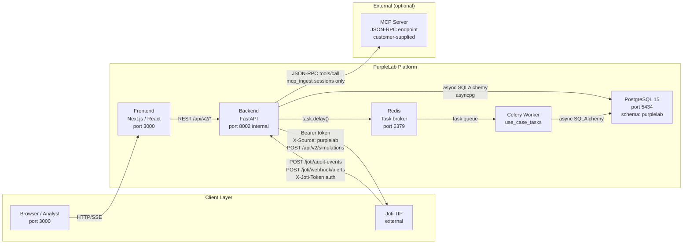
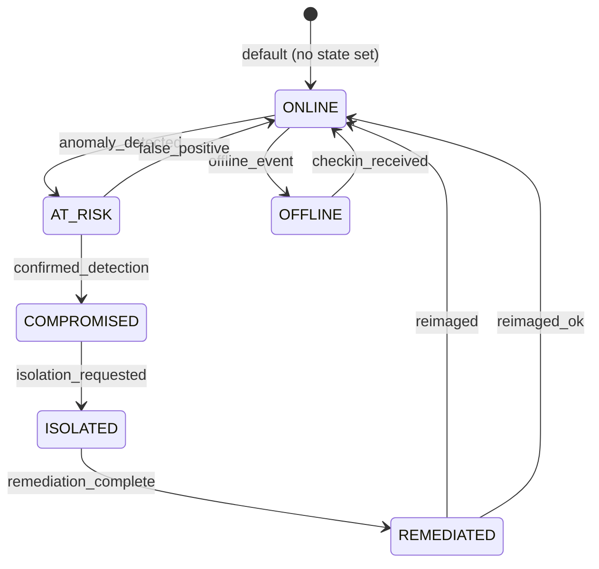
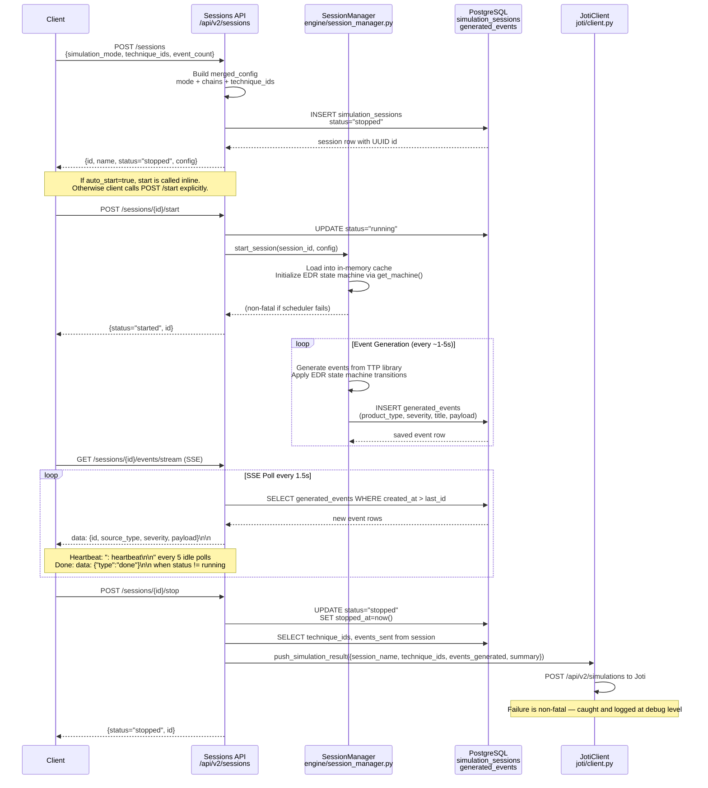
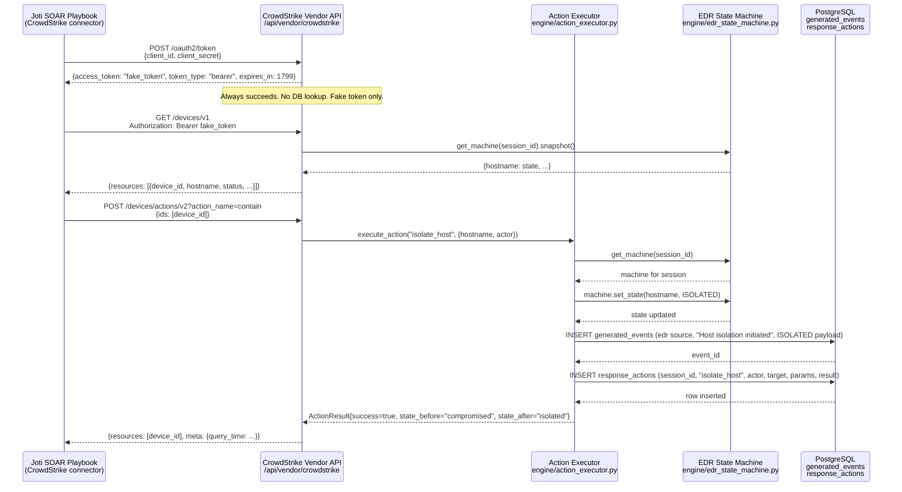
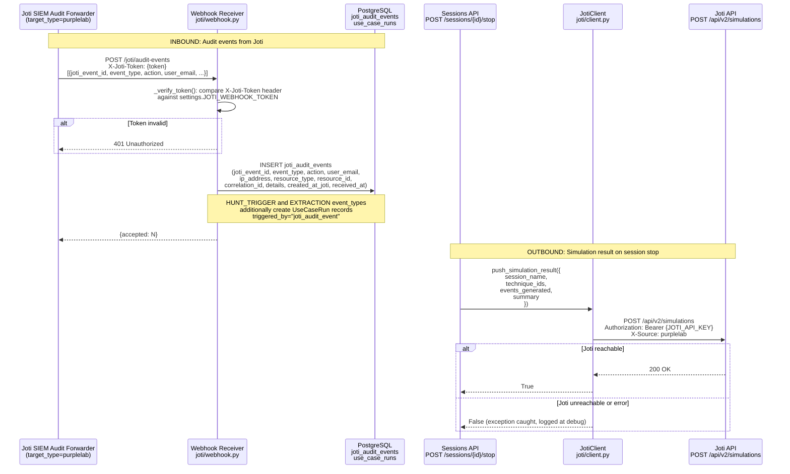
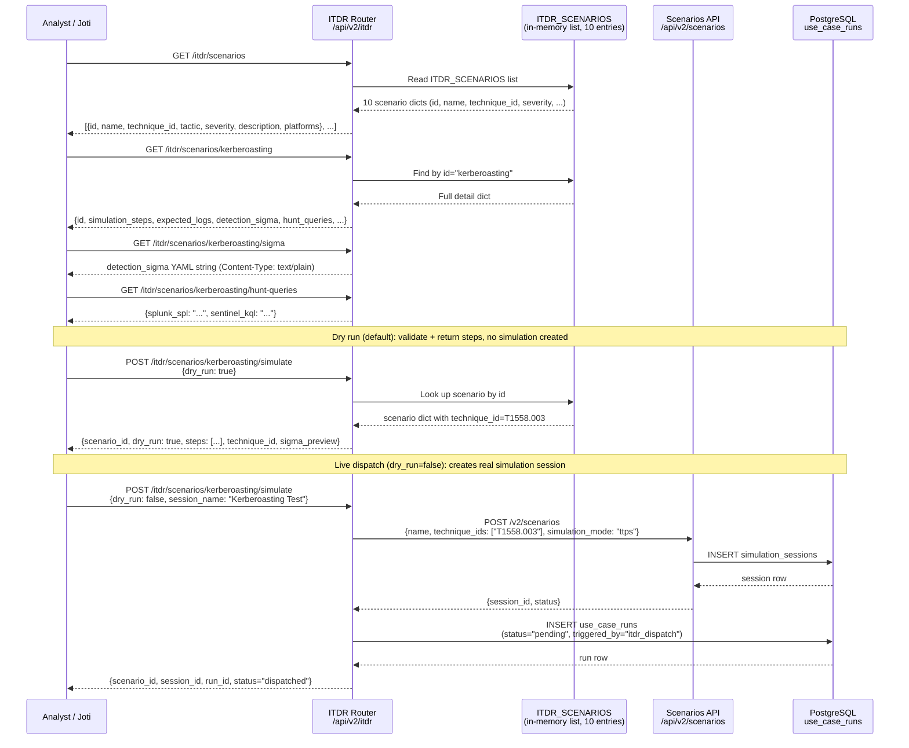
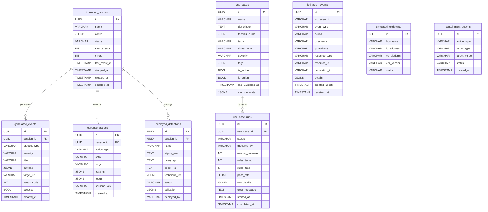
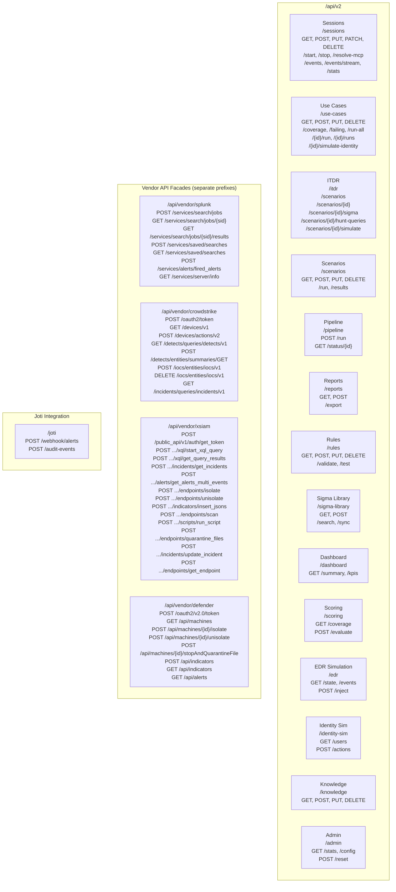
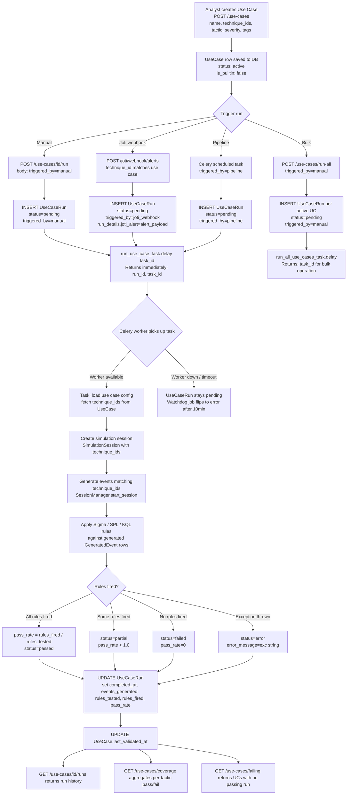

# PurpleLab Architecture Diagrams

**Version:** 1.0 | **Date:** 2026-07-26

This document contains all architectural Mermaid diagrams for the PurpleLab platform. Every diagram is grounded in the actual source code and reflects the production codebase as of the date above.

---

## Diagram 1 — System Architecture Overview

Shows the full deployed topology: services, ports, and communication directions.

**Notes:**
- The backend runs on port 8002 inside Docker but is exposed via the frontend Next.js proxy.
- Redis serves both as Celery broker and as a potential cache layer for vendor API state.
- The Joti connection is bidirectional: Joti pushes audit events inbound; PurpleLab pushes simulation results outbound.
- MCP server communication is triggered only when `simulation_mode="mcp_ingest"` and `POST /sessions/{id}/resolve-mcp` is called.

---

## Diagram 2 — EDR State Machine

Exact states and trigger labels from `backend/engine/edr_state_machine.py`. Technique triggers are listed in the notes below the diagram.

**Technique-to-Trigger Mapping (from `_TECHNIQUE_TRIGGERS`):**

| Technique | Trigger | Effect from ONLINE |
|-----------|---------|-------------------|
| T1059, T1059.001, T1059.003 | anomaly_detected | ONLINE → AT_RISK |
| T1078 | anomaly_detected | ONLINE → AT_RISK |
| T1021, T1021.001, T1021.002 | anomaly_detected | ONLINE → AT_RISK |
| T1105 | anomaly_detected | ONLINE → AT_RISK |
| T1547, T1547.001 | anomaly_detected | ONLINE → AT_RISK |
| T1053.005 | anomaly_detected | ONLINE → AT_RISK |
| T1003, T1003.001 | confirmed_detection | ONLINE → AT_RISK skipped; only fires from AT_RISK |
| T1055, T1055.001 | confirmed_detection | fires from AT_RISK → COMPROMISED |
| T1041 | confirmed_detection | fires from AT_RISK → COMPROMISED |
| T1486 (Ransomware) | confirmed_detection | fires from AT_RISK → COMPROMISED |

**High-fidelity source override:** Sources in `{"edr", "crowdstrike_edr", "crowdstrike"}` always emit `confirmed_detection` regardless of technique_id.

**Secondary events per transition:**

| New State | EDR Alert | Windows Event ID |
|-----------|-----------|-----------------|
| AT_RISK | Yes (medium) | 4719 |
| COMPROMISED | Yes (high) | 4688 |
| ISOLATED | Yes (high) + auto-isolation event | 7045 |
| REMEDIATED | Yes (info) | 1102 |

---

## Diagram 3 — Session Lifecycle Sequence

From session creation through start, event generation, stop, and Joti push. Based on `backend/api/v2/sessions.py` and `backend/engine/session_manager.py`.

---

## Diagram 4 — Vendor Simulation Flow: CrowdStrike Isolate

How a CrowdStrike isolation request flows from the Joti SOAR connector through the vendor API facade into the action executor and EDR state machine.

---

## Diagram 5 — Joti Integration: Bidirectional Data Flow

Inbound audit event stream from Joti's SIEM forwarder and outbound simulation result push.

---

## Diagram 6 — ITDR Scenario Execution

From scenario listing through dry-run and live dispatch, based on `backend/api/v2/itdr.py`.

---

## Diagram 7 — Database Entity Relationship

Key tables and their relationships. Based on `backend/db/models.py`.

---

## Diagram 8 — API Surface Map

All route groups with their URL prefixes, grouped by domain. Based on `backend/api/v2/__init__.py` router registrations.

---

## Diagram 9 — Use Case Execution Pipeline

Full flow from use case creation through Celery task execution to a terminal UseCaseRun result. Based on `backend/api/v2/use_cases.py` and `backend/tasks/use_case_tasks.py`.

---

## Summary: Diagram Index

| # | Title | Diagram Type | Primary Source Files |
|---|-------|-------------|----------------------|
| 1 | System Architecture | graph LR | docker-compose, config.py |
| 2 | EDR State Machine | stateDiagram-v2 | engine/edr_state_machine.py |
| 3 | Session Lifecycle Sequence | sequenceDiagram | api/v2/sessions.py, engine/session_manager.py |
| 4 | Vendor Flow: CrowdStrike Isolate | sequenceDiagram | api/vendor/crowdstrike, engine/action_executor.py |
| 5 | Joti Integration Bidirectional | sequenceDiagram | joti/client.py, joti/webhook.py |
| 6 | ITDR Scenario Execution | sequenceDiagram | api/v2/itdr.py |
| 7 | Database ERD | erDiagram | db/models.py |
| 8 | API Surface Map | graph TD | api/v2/__init__.py |
| 9 | Use Case Execution Pipeline | flowchart TD | api/v2/use_cases.py, tasks/use_case_tasks.py |
